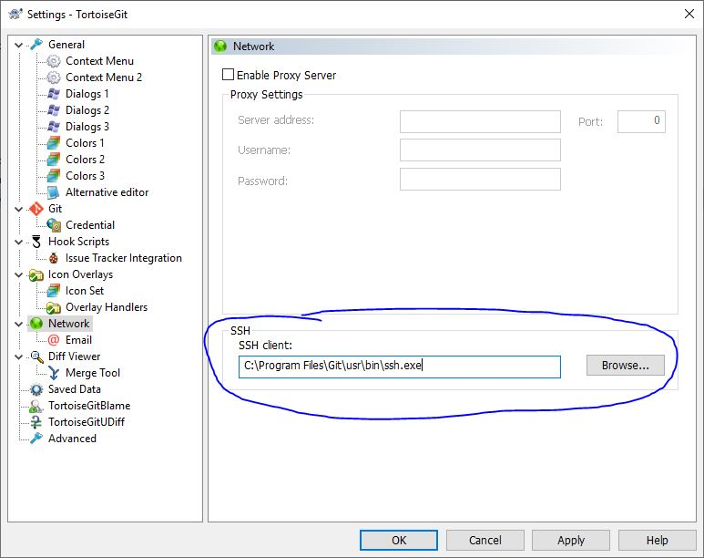

# SSH add assistant (Windows)
A script to create an SSH key and save it to ssh/config and upload the key to gamesgit with minimal effort

This has been tested on Windows 10 ONLY.
It's likely to work on 7/8 as well.

## Requirements
* Git including ssh-keygen, ssh-keyscan which come included in the installer at https://git-scm.com/download/win

## What you don't need - infact this setup will stop the below from working with version control
* Putty
* PuttyGen
* Pagent

## Setup steps
1. Download and extract the repository making sure to download the *windows-batch* branch [download link](https://github.com/zakarybk/gamesgit-ssh-assistant/archive/windows-batch.zip)
2. Run *setup-gamesgit.bat* and follow the instructions (Your anti-virus maybe triggered as this adds a .bat (ssh.bat) file to Startup apps, you will need to exclude the script in order for the setup to be successful)
3. Change the SSH client in your version control software to C:\Program Files\Git\usr\bin\ssh.exe - example uses TortoiseGit

4. Once that's setup, clone using ssh. No need to touch it again since it will work through restarts.

If you need to add more SSH keys such as for GitHub then go to C:\Users\USERNAME\\.ssh and open *config*.
Below is an example of one I added for GitHub (add new lines after the one for games git)
```
Host github.com
  IdentityFile C:\Users\Zak\.ssh\zakarybk_git
  User zakarybk
```
